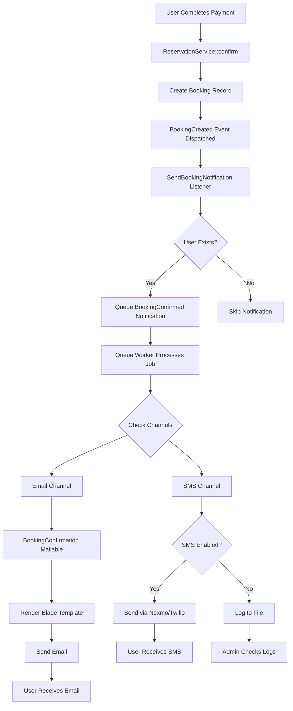
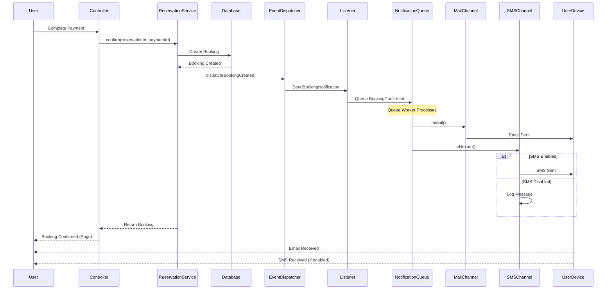
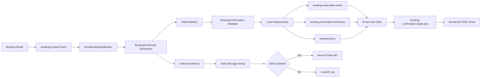
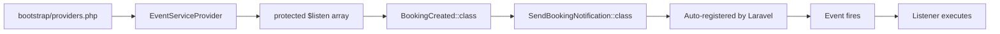
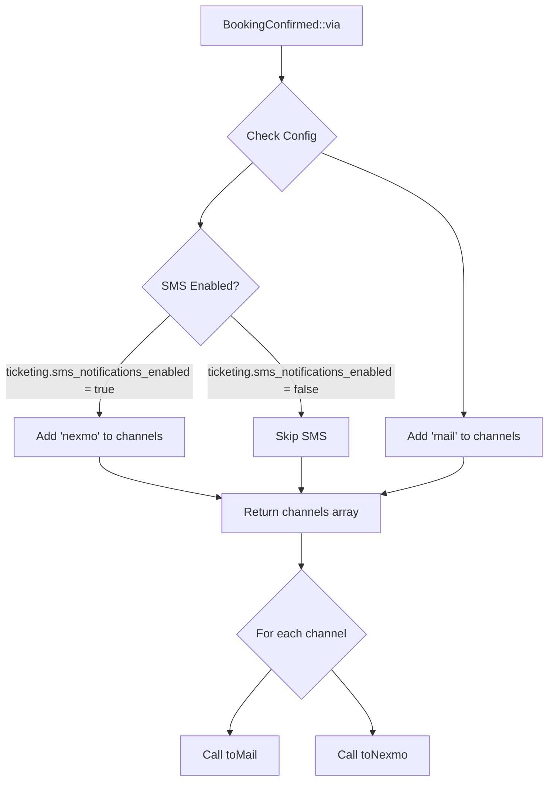
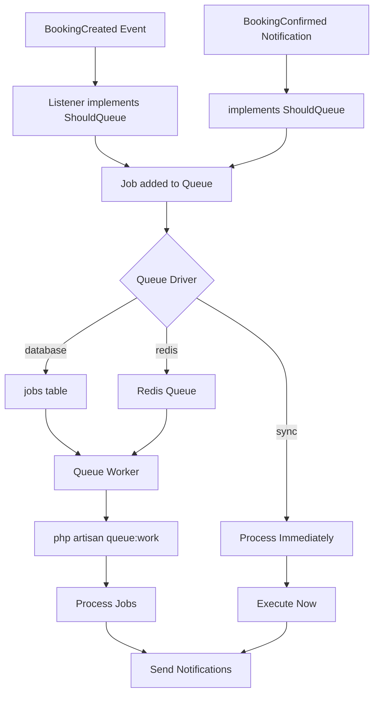
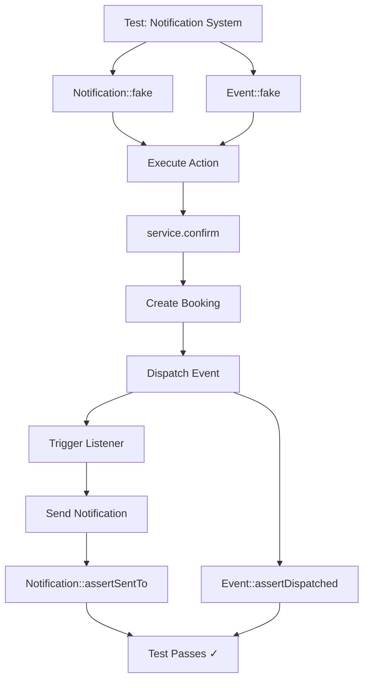
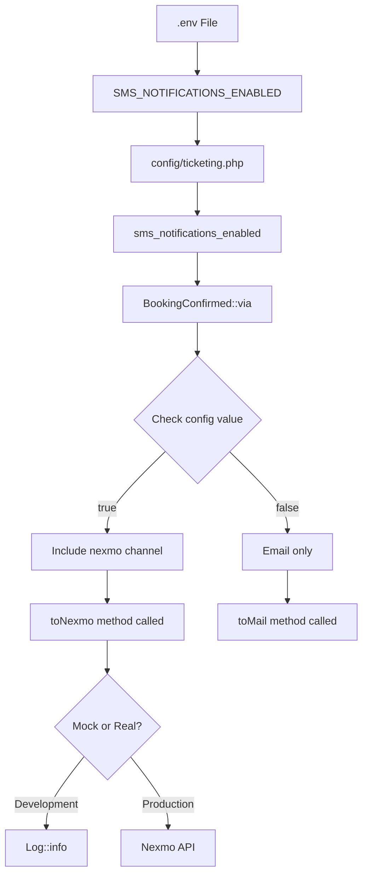

# Notification System Flow Diagram

## System Architecture



## Component Interaction



## Data Flow



## File Structure

```
tbs/
├── app/
│   ├── Events/
│   │   └── BookingCreated.php ..................... Event dispatched on booking creation
│   ├── Listeners/
│   │   └── SendBookingNotification.php ............. Handles BookingCreated event
│   ├── Notifications/
│   │   └── BookingConfirmed.php .................... Multi-channel notification
│   ├── Mail/
│   │   └── BookingConfirmation.php ................. Email mailable class
│   ├── Providers/
│   │   └── EventServiceProvider.php ................ Registers events/listeners
│   └── Services/
│       └── Reservation/
│           └── ReservationService.php .............. Dispatches event (modified)
├── resources/
│   └── views/
│       └── emails/
│           └── booking-confirmation.blade.php ...... Email template
├── config/
│   └── ticketing.php ............................... SMS config added
├── bootstrap/
│   └── providers.php ............................... EventServiceProvider registered
└── tests/
    └── Feature/
        └── Notifications/
            └── BookingNotificationTest.php ......... Notification tests
```

## Event-Listener Registration



## Notification Channel Decision



## Queue Processing



## Email Template Structure

```
┌─────────────────────────────────────┐
│  Header (Gradient Purple)          │
│  🎉 Booking Confirmed!              │
└─────────────────────────────────────┘
┌─────────────────────────────────────┐
│  Content Section                    │
│  ┌───────────────────────────────┐  │
│  │ ✓ Payment Successful          │  │
│  └───────────────────────────────┘  │
│                                     │
│  ┌───────────────────────────────┐  │
│  │   Booking Code                │  │
│  │   BK-XXXXXXXXXX               │  │
│  └───────────────────────────────┘  │
│                                     │
│  ┌───────────────────────────────┐  │
│  │ Event Details                 │  │
│  │ 📅 Date & Time                │  │
│  │ 📍 Venue                      │  │
│  │ 📌 Location                   │  │
│  └───────────────────────────────┘  │
│                                     │
│  ┌───────────────────────────────┐  │
│  │ 🎫 Ticket Details             │  │
│  │ Ticket Type, Quantity, Price  │  │
│  │ Total Amount                  │  │
│  └───────────────────────────────┘  │
│                                     │
│  ┌───────────────────────────────┐  │
│  │     QR Code Placeholder       │  │
│  │         📱                    │  │
│  └───────────────────────────────┘  │
│                                     │
│  [View Booking Details Button]      │
│                                     │
│  ⚠️ Important Instructions          │
└─────────────────────────────────────┘
┌─────────────────────────────────────┐
│  Footer (Gray)                      │
│  Help • Support • Terms             │
│  © 2025 Ticket Booking System       │
└─────────────────────────────────────┘
```

## Testing Flow



## Configuration Flow



## Summary

This notification system provides:
- ✅ Automatic notifications on booking confirmation
- ✅ Professional email templates
- ✅ Optional SMS notifications
- ✅ Queue-based background processing
- ✅ Mock SMS for testing
- ✅ Event-driven architecture
- ✅ Easy configuration
- ✅ Comprehensive testing
